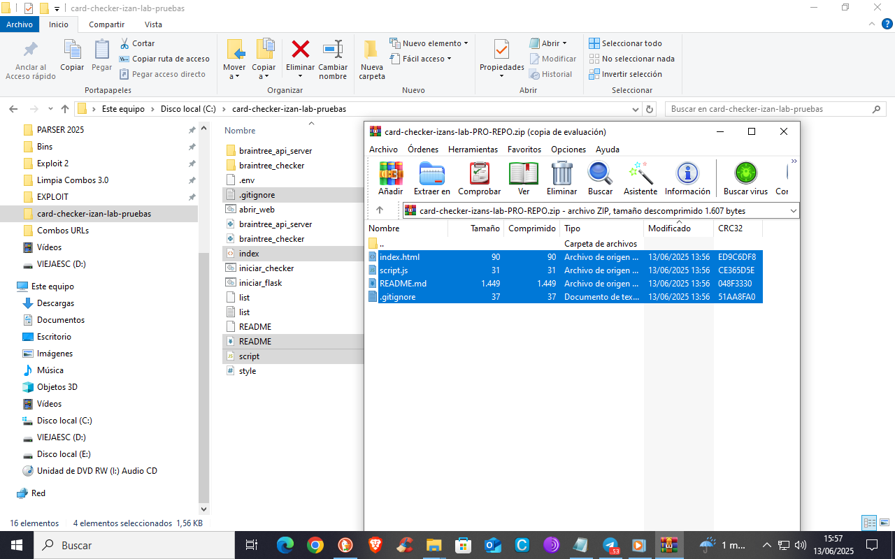

  

# 💳 Verificador de Tarjetas – IZAN'S LAB

Proyecto completo para la verificación de tarjetas de crédito desde **terminal (Python)** y desde una **interfaz web (Vercel)**. Herramienta con fines educativos y de análisis técnico.

---

## 🌐 Verificador Web (Frontend + API)

🔗 **[Demo Web en Vercel](https://card-checker-izan-lab-pruebas.vercel.app/)**

### ⚙️ Características Web
- ✅ Verificación de tarjetas vía API de Braintree (sandbox).
- 🧠 Eliminación automática de tarjetas ya procesadas del input.
- 🧹 Evita validar tarjetas duplicadas.
- 🎨 Interfaz limpia y responsiva.
- 🎨 Títulos mejorados con color **lila** y **celeste**.

## 🐍 Verificador por Terminal (Python)

### ⚙️ Características
- ✅ Validación de tarjetas utilizando un endpoint de pago real (Braintree).
- 🔍 Consulta de información del BIN: banco, país, tipo, etc.
- 📄 Lectura masiva desde archivo `.txt`.
- ⏱️ Retraso configurable entre tarjetas.
- 📌 No requiere proxy.

## ⚠️ Aviso Legal
Este proyecto es **estrictamente educativo**. El uso indebido puede violar leyes locales o los términos de servicios de las APIs utilizadas. El autor **no se responsabiliza** por el uso que se le dé.

## 👑 Autor
- Creado por ®️ **®IZAN'S LAB®**
- Grupo Telegram: 💳 ESCUELA BINS Y CCS SOLO AMIGOS 💸
- Año: 2025
