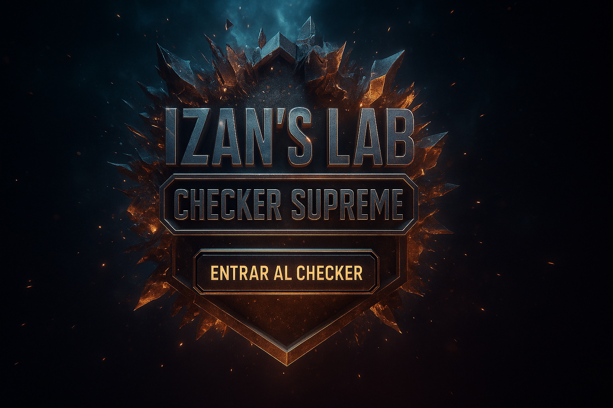

  

# 💳 ® Verificador y Validador de Tarjeta de Crédito IZAN'S LAB ®

🎬 *El mejor verificador/validador de tarjetas de crédito premium de la historia.*

---

## 🚀 Demo en producción

🔗 **Frontend (Vercel):** [https://card-checker-izan-lab.vercel.app](https://card-checker-izan-lab.vercel.app)  
🔗 **Backend (Render):** [https://checker-backend-render.onrender.com](https://checker-backend-render.onrender.com)

---

## 🧠 ¿Qué hace este checker?

- 🔄 Verifica tarjetas usando múltiples pasarelas (Stripe, Braintree, PayPal, Authorize.net, etc.)
- 🧠 Extrae BIN completo: banco, país, tipo, marca y bandera.
- 💥 Muestra tarjeta **completa** (no oculta) en estilo visual épico.
- 🎵 Integra música de fondo y sonidos al detectar tarjetas vivas.
- 💣 Al detectar una tarjeta válida: **sonido de disparo o bomba nuclear.**
- 🧾 Botón “Descargar Vivas” funcional (exporta en `.txt`).
- 💅 Estética visual oscura + profesional, con colores llamativos (lila, celeste).
- 🔊 Animaciones y efectos responsivos.
- 📱 Preparado para versión móvil y APK.

---

## 🛠️ Tecnologías utilizadas

- Frontend: **HTML + CSS + JavaScript**
- Backend: **Python (Flask)** desplegado en Render
- Estilo visual personalizado
- Audio integrado
- API multigateway
- Despliegue automático con GitHub + Vercel + Render

---

## 📸 Preview

> ¡Visual impactante de validación de tarjetas!

  

---

## ⚠️ Aviso legal

Este proyecto es **exclusivamente educativo**. El autor no se responsabiliza por el uso que se le dé.  
Toda verificación se realiza mediante entornos de pruebas/sandbox o bin lookup.  
**No fomenta el uso indebido o fraudulento de tarjetas reales.**

---

## 👑 Autor

- Creado por: **® IZAN’S LAB ®**
- Grupo: 💳 ESCUELA BINS Y CCS SOLO AMIGOS 💸
- Año: 2025

---
